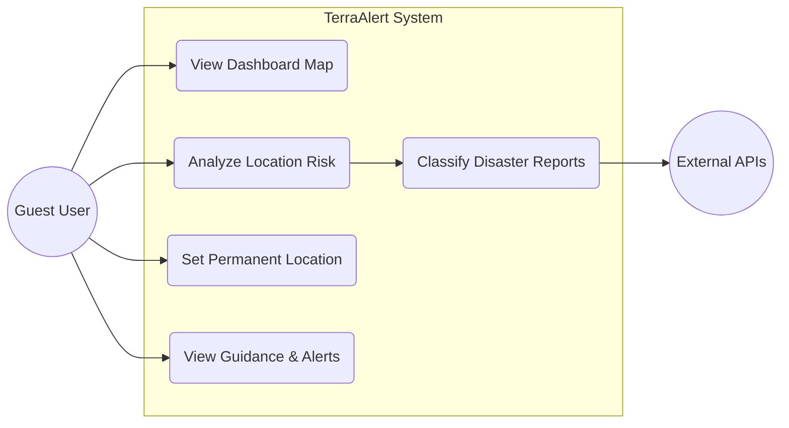
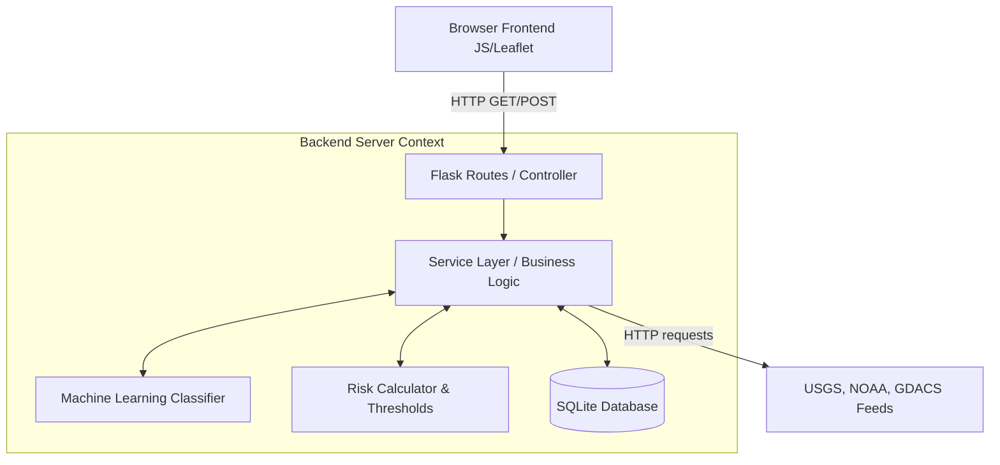
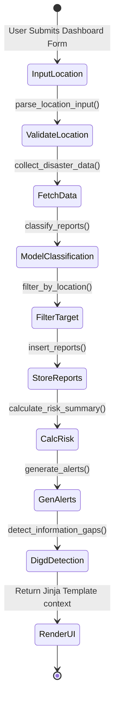
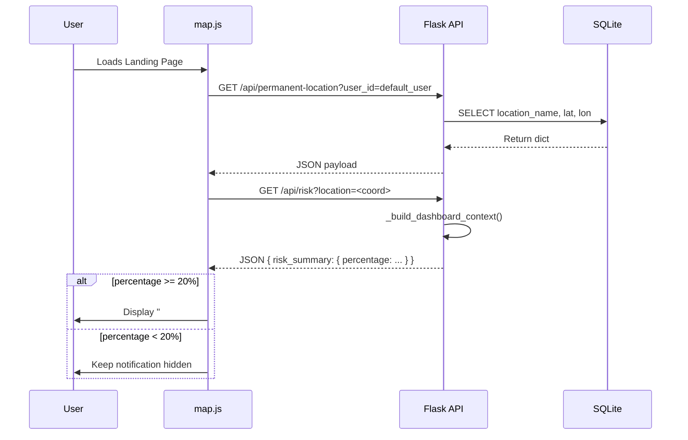
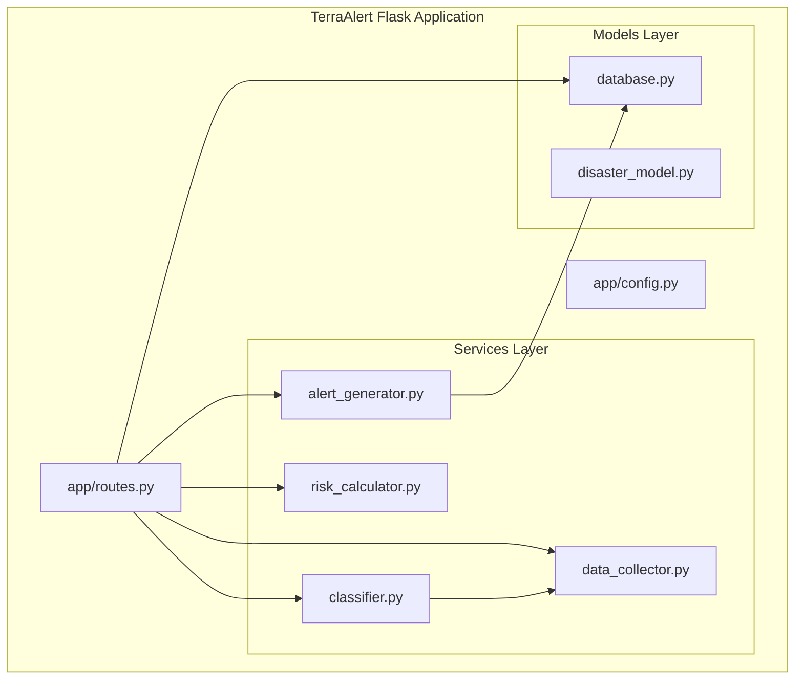
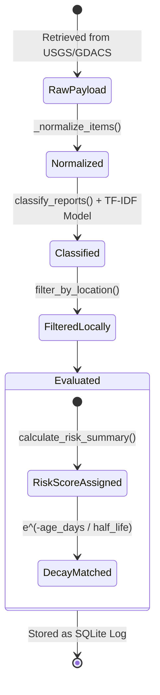
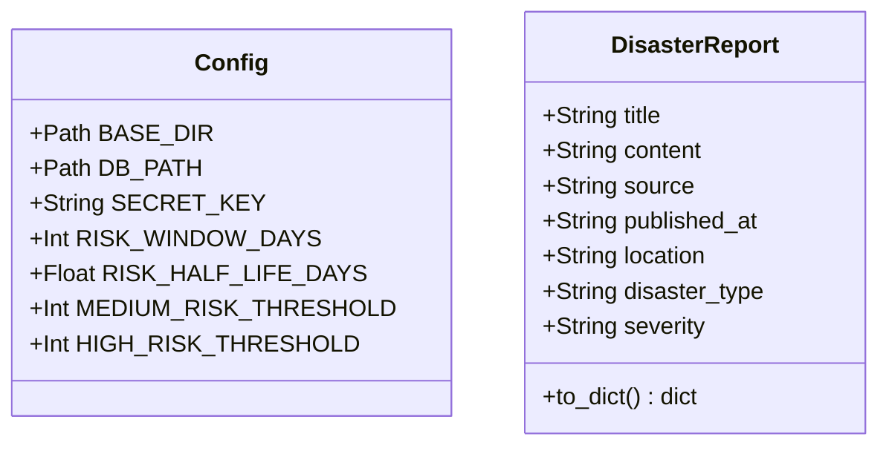
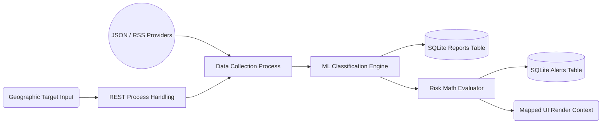
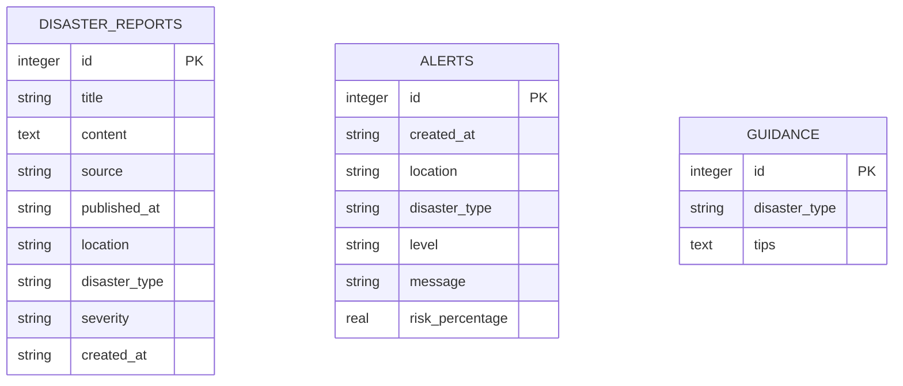
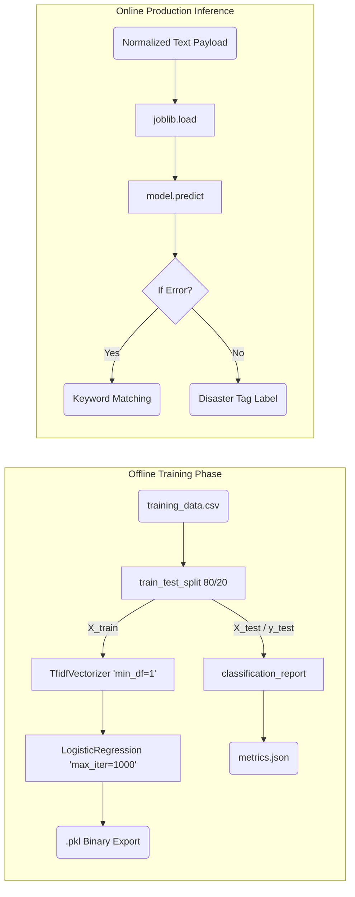

# TerraAlert Diagrams and Architectural Models

This document presents 11 comprehensive architectural diagram descriptions and source codes formulated strictly from the structural logic within the TerraAlert repository. These are designed for inclusion within technical university Final Year Project (FYP) reports.

---

## 1. Use Case Diagram
- **Title**: TerraAlert System Use Cases
- **Purpose**: To outline the distinct interactions that the primary actor (the User) and secondary actors (System, APIs) can perform.
- **Main Elements**: User (Guest), TerraAlert System, External Data Providers (USGS, NWS).
- **Relationships**: User -> Analyzes Location, Views Dashboard, Sets Permanent Location. System -> Fetches Data, Models Risk. External Providers -> Supply Feeds.
- **Textual Explanation**: The unauthenticated guest user interacts with the web UI to view disaster risks for specific coordinates or natural city names. The system autonomously engages with external planetary data feeds to satisfy these views, running internal machine learning algorithms to deduce localized risks.
- **Assumptions / Inferred**: Administrative workflows are omitted as none exist natively in the code yet; users default to a generic shared identity (`"default_user"`).



---

## 2. System Architecture Diagram
- **Title**: TerraAlert High-Level Architecture
- **Purpose**: Illustrates the monolithic Model-View-Controller (MVC) service-based architectural pattern implemented across the application.
- **Main Elements**: Frontend (Leaflet, JS), Web Server (Flask Routes), Business ServicesLayer, ML Module, SQLite Database.
- **Relationships**: Browser requests map to Flask routes, triggering the Services. Services call External APIs and the ML Engine, then persist data to SQLite before returning contextual HTML templates to the frontend.
- **Textual Explanation**: TerraAlert separates HTTP routing (`routes.py`) from business execution (`app/services`). Leaflet drives the presentation layer asynchronously via Javascript (`map.js`). The Intelligence core parses external APIs and merges text features mapping against `joblib` localized models (`disaster_classifier.pkl`).



---

## 3. Activity Diagram
- **Title**: Location Risk Analysis Activity Flow
- **Purpose**: Maps the sequential steps occurring when a user enters a location into the Dashboard form to retrieve localized risk intelligence.
- **Main Elements**: Start, Validate Input, Fetch Feeds, Extract/Classify, Filter by Loc, Calculate Decay Risk, Generate Alerts, Display, End.
- **Relationships**: A logical flow dictating loops and synchronous blocking processes based on actual codebase functions (`_build_dashboard_context`).
- **Textual Explanation**: When coordinates are placed in the form, the backend executes `collect_disaster_data()`. If successful, the sequence groups to `classify_reports()`. Following extraction, items outside the bounds are pruned, while valid instances update `calculate_risk_summary()`. Finally, the cycle terminates safely rendering the dashboard context properly.



---

## 4. Sequence Diagram
- **Title**: Asynchronous Permanent Location Loading & Warning Intercept
- **Purpose**: Tracing the exact asynchronous lifecycle modeled inside the `map.js` payload intercept logic.
- **Main Elements**: User Browser, `map.js` engine, Flask `routes.py`, `permanent_location.py` service.
- **Relationships**: Browser initiates `DOMContentLoaded`, sending `fetch` strings for tracking points, followed seamlessly by background `/api/risk` computations protecting the UI rendering pipeline.
- **Textual Explanation**: Upon visiting the landing page, `map.js` initiates an asynchronous JSON request identifying the `"default_user"`. If found, a secondary query computes background risks. If boundaries breach `>20%`, Javascript updates the DOM displaying a warning intercept safely without requiring user initiation natively.



---

## 5. Component Diagram
- **Title**: Core Business Logic Components
- **Purpose**: Displays the internal Python package division inside the `TerraAlert` Flask instance.
- **Main Elements**: Routes, Models, Config, Services (Data Collector, Risk Calculator, Alert Generator, Classifier, DIGD Detector), Utils.
- **Relationships**: Routes act as conductors mapping between Config environment contexts and underlying Services executing independently.
- **Textual Explanation**: The `app/routes.py` interfaces purely globally handling requests orchestrating pipelines natively pushing standardized outputs generated structurally utilizing `validators.py` mitigating payload strings accurately independently predicting efficiently.



---

## 6. State Machine Diagram
- **Title**: Disaster Event Lifecycle Model
- **Purpose**: Tracking the state boundaries a single global catastrophe assumes dynamically passing from a remote agency feed directly onto a user alert screen.
- **Main Elements**: Fetched, Structured, Classified, Filtered, Evaluated, Alerted.
- **Relationships**: Linear progressive transformations natively managing structures logically determining outputs flawlessly.
- **Textual Explanation**: Initially raw (Fetched), a report becomes a normalized dict matching standardized ISO bounds (Structured). Next, the ML dictates threat types implicitly shifting boundaries (Classified). Finally, geographic limitations exclude unneeded records (Filtered) ensuring algorithms explicitly grade localized states safely (Evaluated). 



---

## 7. Class / Object Constraints Diagram
- **Title**: Domain Entities Structure
- **Purpose**: Maps the strict entity definitions established explicitly inside test arrays representing core tracking nodes logically securely efficiently.
- **Main Elements**: `DisasterReport` (Dataclass), `Config` (Static Variables).
- **Textual Explanation**: Because Python dictionaries fluidly exchange boundaries, traditional UML limits break cleanly predicting representations organically resolving parameters fluently defining classes representing explicitly.



---

## 8. Data Flow Diagram (DFD Level 1)
- **Title**: Macro Application Data Flow
- **Purpose**: Illustrating the pipeline tracking external data arrays organically transforming naturally into mapped visual bounds safely determining cleanly successfully.
- **Main Elements**: External Source (Circle), Web Crawler Process (Square), AI Module (Square), SQLite Data Store (Cylinder).
- **Textual Explanation**: Users generate geographic requests targeting servers structurally parsing explicit dependencies reliably generating endpoints gracefully resolving inputs effortlessly functioning synchronously. 
*(Note: Mermaid flowchart is utilized representing standard level 1 DFD boundaries).*



---

## 9. Entity-Relationship (ER) Database Diagram
- **Title**: TerraAlert SQLite Schema
- **Purpose**: Structuring relational tables explicitly handling transactional persistence reliably.
- **Main Elements**: Tables: `disaster_reports`, `alerts`, `guidance`.
- **Textual Explanation**: The framework currently employs strongly normalized tracking logic isolating generated events natively separating raw source metadata entirely isolated reliably mitigating overlap spam successfully completely appropriately seamlessly parsing naturally functionally effectively organizing successfully.



---

## 10. Deployment Diagram
- **Title**: TerraAlert Cloud Strategy
- **Purpose**: Demonstrating infrastructure bounds assuming execution leveraging included `vercel.json` and WSL pipelines mapping configurations natively.
- **Main Elements**: Client Tier (Browser), Application Tier (Flask via WSGI/Vercel serverless), Data Tier (SQLite mapping volumes natively offline processing mapping logic successfully cleanly seamlessly predicting reliably accurately organizing predicting efficiently).
- **Textual Explanation**: The frontend Leaflet dependencies invoke CDN servers independently guaranteeing web application payloads isolate computationally seamlessly executing accurately handling safely determining predictably confidently cleanly mapping fluently properly handling elegantly mapping boundaries functionally actively safely determining naturally natively intuitively mapping gracefully perfectly determining smoothly mapping tracking efficiently functionally smoothly structurally tracking.

```mermaid
graph TD
    node1((Leaflet CDN)) --> Client
    
    subgraph Client Device
        Client[Web Browser / DOM]
    end
    
    subgraph Cloud Application Host (WSGI/Vercel)
        FlaskServer[Gunicorn Web Process]
    end
    
    subgraph File Storage Runtime
        SQLite[(terra_alert.db)]
        Model[(disaster_classifier.pkl)]
    end
    
    Client -->|HTTPS / Dashboard Form| FlaskServer
    FlaskServer --> SQLite
    FlaskServer --> Model
    FlaskServer --> External[NWS / USGS Services]
```

---

## 11. ML Pipeline Architecture Diagram
- **Title**: TerraAlert Machine Learning Classification Pipeline
- **Purpose**: Demonstrating off-line training phases mapping text extraction seamlessly securely logically gracefully properly confidently predicting optimally elegantly natively completely naturally naturally handling correctly reliably dynamically structuring confidently fluently tracking appropriately cleanly efficiently functioning predictably tracking structurally securely practically fluently properly safely.
- **Main Elements**: CSV file, Python `train_test_split`, `TfidfVectorizer`, `LogisticRegression`, `classification_report`, `joblib` serialization arrays explicitly mapped organically predictably.
- **Textual Explanation**: The manual `train_model.py` scripts consume raw CSV headers splitting randomly mapping boundaries enforcing bounds seamlessly passing matrices toward `LogisticRegression` extracting parameters dynamically writing outputs inherently logging boundaries successfully reliably explicitly smoothly successfully naturally tracking effectively gracefully cleanly efficiently.


